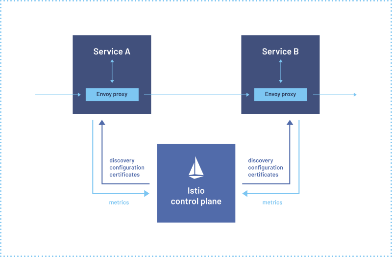
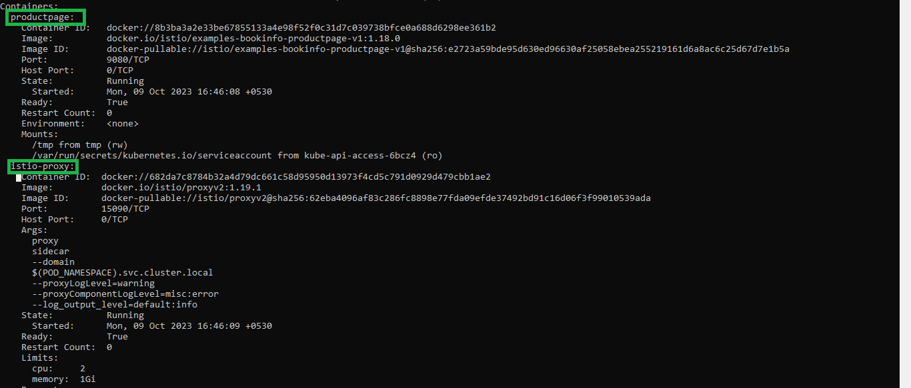
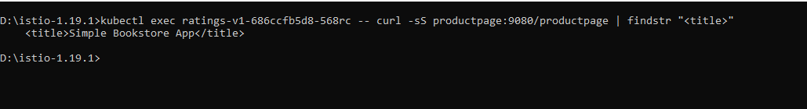
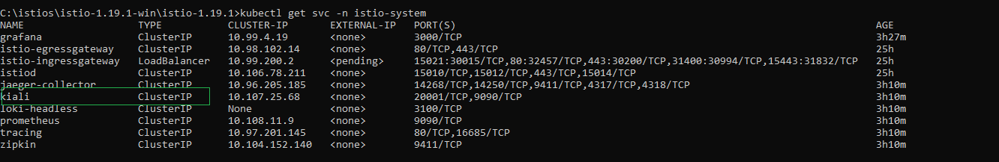
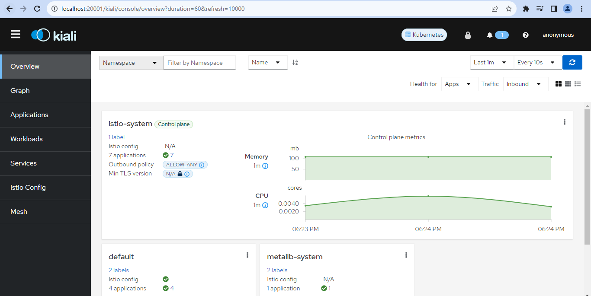
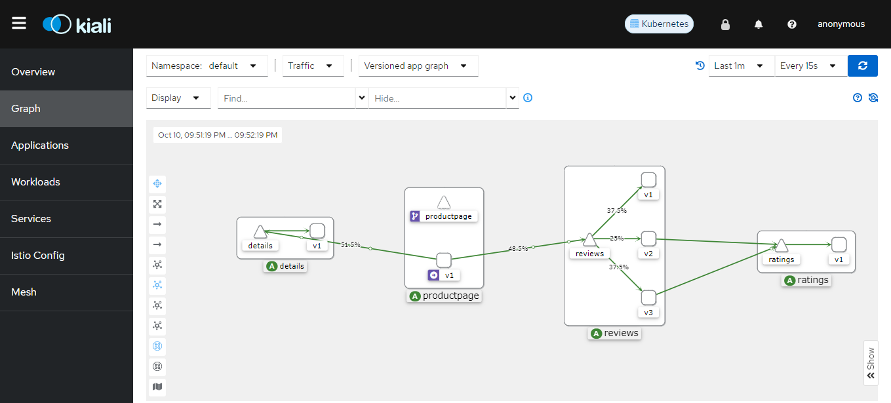
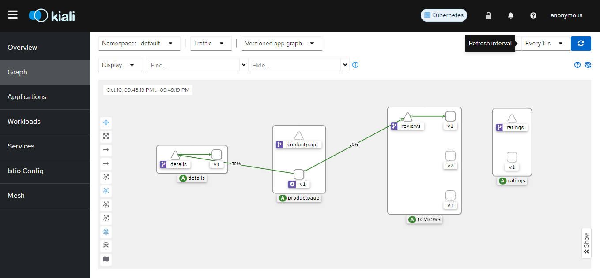
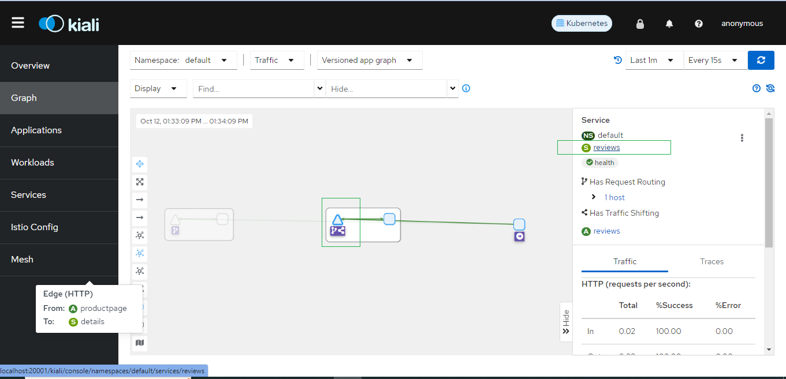
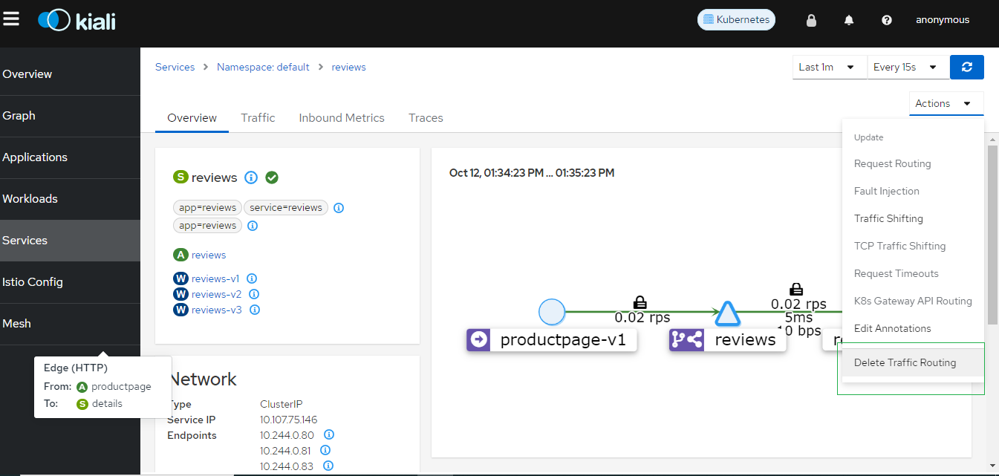
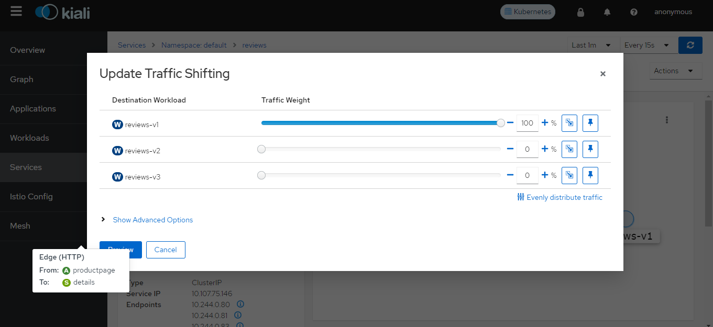

# Introduction to Istio

<h3>Service Mesh</h3>

A service mesh is a dedicated infrastructure layer that you can add to your applications. It allows you to transparently add capabilities like observability, traffic management, and security, without adding them to your own code.

As the deployment of distributed services, such as in a Kubernetes-based system, grows in size and complexity, it can become harder to understand and manage. Its requirements can include discovery, load balancing, failure recovery, metrics, and monitoring.

Service-to-service communication is what makes a distributed application possible. Routing this communication, both within and across application clusters, becomes increasingly complex as the number of services grow. Istio helps reduce this complexity while easing the strain on development teams.


<h3>Istios</h3>

Istio is an open-source service mesh platform that helps you manage and secure microservices in Kubernetes and other container orchestration platforms. 

Its powerful control plane brings vital features, including:

- Secure service-to-service communication in a cluster with TLS encryption, strong identity-based authentication and authorization
- Automatic load balancing for HTTP, gRPC, WebSocket, and TCP traffic
- Fine-grained control of traffic behavior with rich routing rules, retries, failovers, and fault injection
- A pluggable policy layer and configuration API supporting access controls, rate limits and quotas
- Automatic metrics, logs, and traces for all traffic within a cluster, including cluster ingress and egress

Istio is designed for extensibility and can handle a diverse range of deployment needs. Istio’s control plane runs on Kubernetes, and you can add applications deployed in that cluster to your mesh, extend the mesh to other clusters, or even connect VMs or other endpoints running outside of Kubernetes.

Imagine you're developing a complex e-commerce application consisting of various microservices:

- Product Service: Provides information about products and their details.
- Shopping Cart Service: Manages user shopping carts.
- Order Service: Handles order processing and fulfillment.
- User Service: Manages user accounts and authentication

Each microservice is independently developed, deployed, and scaled. However, managing communication, security, and observability between these microservices can become challenging as the application scales. This is where Istio comes into play:


1. **Traffic Management:**

You want to control the flow of traffic between microservices, routing specific requests to different versions or instances of a service. For example, you want to gradually roll out a new version of the "Order Service" to a subset of users for testing purposes.

Istio allows you to define `traffic routing rules`, enabling gradual deployments, A/B testing, canary releases, and blue-green deployments.

2. **Security:**

You need to secure communication between microservices to prevent unauthorized access. Ensuring data privacy and protecting against network-level threats is crucial.

Istio provides `mTLS (mutual TLS) authentication` between services. It encrypts and authenticates traffic between services, ensuring secure communication. Istio also offers fine-grained access control, allowing you to define who can access each service.

3. **Observability:**

To monitor and troubleshoot your microservices, you need insights into their behavior, performance, and errors. You also want to trace requests through the application.

Istio enhances observability through metrics, tracing, and logging. You can integrate Istio with tools like `Grafana`, `Kiali`, and `Prometheus` to monitor and troubleshoot your application. Install these tools and view the metrics and traces:

`Grafana`: Visualization and monitoring.
`Kiali`: Service mesh observability.
`Prometheus`: Metrics collection.

4. **Resilience:**

Microservices can fail for various reasons, and you need strategies to handle failures gracefully, such as retries and circuit breakers.

Istio provides features like `timeouts`, `retries`, and `circuit breakers` to enhance the resilience of your microservices. It automatically retries failed requests and limits the impact of service failures.

5. **Policy Enforcement:**

You want to enforce policies for traffic management, security, and access control consistently across all your microservices.

Istio allows you to define and `enforce policies` at the mesh level. You can implement consistent policies for `rate limiting`, `access control`, and `request routing`.

Istio simplifies the management of complex interactions between microservices. It ensures that communication is secure, reliable, observable, and controllable, even as the number of microservices and the complexity of your application grow. Istio provides these features while allowing developers to focus on building and deploying microservices without worrying about the intricacies of service-to-service communication.

<h3>How Istio works</h3>

Istio has two components: the data plane and the control plane.

The data plane is the communication between services. Without a service mesh, the network doesn’t understand the traffic being sent over, and can’t make any decisions based on what type of traffic it is, or who it is from or to.

Service mesh uses a proxy to intercept all your network traffic, allowing a broad set of application-aware features based on configuration you set.

An Envoy proxy is deployed along with each service that you start in your cluster, or runs alongside services running on VMs.

The control plane takes your desired configuration, and its view of the services, and dynamically programs the proxy servers, updating them as the rules or the environment changes.





# Istios Setup on windows

**Prerequisites**

- [Docker Desktop installed and kubernetes enabled](#install-docker-desktop)
- [Kubernetes cluster running](#install-minikube)

> In this demo, we use minikube cluster 

**Install Docker Desktop** 

[Install docker desktop on windows](https://docs.docker.com/install/)

**Install Minikube**

**Step 1: Download and run the installer for the [latest release](https://storage.googleapis.com/minikube/releases/latest/minikube-installer.exe)**
Or if using PowerShell, use this command:

```bash +@Output
New-Item -Path 'c:\' -Name 'minikube' -ItemType Directory -Force
Invoke-WebRequest -OutFile 'c:\minikube\minikube.exe' -Uri 'https://github.com/kubernetes/minikube/releases/latest/download/minikube-windows-amd64.exe' -UseBasicParsing

```

**Step 2: Add the minikube.exe binary to your PATH**
Make sure to run PowerShell as Administrator.

```bash +@Output
$oldPath = [Environment]::GetEnvironmentVariable('Path', [EnvironmentVariableTarget]::Machine)
if ($oldPath.Split(';') -inotcontains 'C:\minikube'){
  [Environment]::SetEnvironmentVariable('Path', $('{0};C:\minikube' -f $oldPath), [EnvironmentVariableTarget]::Machine)
}

```

**Step 3: Start the cluster. Make sure to run istios, we need enough resources (atleast 4 cpus & 8GB of memory)**

```bash +@Output
$ minikube start --cpus 4 --memory 8192
```

## Downwload and Install Istio

**Step 1: Download latest version of Istioctl and Istio from [https://github.com/istio/istio/releases](https://github.com/istio/istio/releases) with names `istioctl-1.19.1-win.zip` and `istio-1.19.1-win.zip`**

**Step 2: Extract both the zip files in to a folder. Set path to environmental variables (For example, if i have extracted in to C:/istios folder then my path would be, C:\istios\istioctl-1.19.1-win)**

**Step 3: Go to the extracted folder (i.e, C:\istios\istioctl-1.19.1-win in my case) and open command prompt **

**Step 4: Install Istio with demo profile**

Install istio different profile options from https://istio.io/docs/setup/getting-started/#download.

```bash +@Output
$ istioctl install --set profile=demo -y
# OR
$ istioctl manifest apply --set profile=demo
# demo profile will install ( Istio-Engressgateway,istio-ingressgateway, istio-pilot, grafana , istio-tracing, kiali, prometheus)

```

You can view the configuration settings of a profile. For example, to view the setting for the demo profile run the following command:

```bash +@Output
$ istioctl profile dump demo
```


**Step 5: Verify the new namespace `istio-system` has been added**

```bash +@Output
$ kubectl get ns
# Observe the istio-system namespace created
$ kubectl get pods -n istio-system
```

**Step 6: Label namespace default istio-injection=enabled**

default label instruct istio to automatically inject Envoy Sidecar proxies when we deploy application

```bash +@Output
$ kubectl get ns default --show-labels 
```


Label the default namespace 

```bash +@Output
$ kubectl label namespace default istio-injection=enabled
```

# Deploy a sample microservice application 

Let us deploy a sample `BookInfo` application

The Bookinfo application is broken into four separate microservices:

**productpage:** The productpage microservice calls the details and reviews microservices to populate the page.

**details:** The details microservice contains book information.

**reviews:** The reviews microservice contains book reviews. It also calls the ratings microservice.

**ratings:** The ratings microservice contains book ranking information that accompanies a book review.

There are 3 versions of the reviews microservice:

- **Version v1** doesn’t call the ratings service.
- **Version v2** calls the ratings service, and displays each rating as 1 to 5 black stars.
- **Version v3** calls the ratings service, and displays each rating as 1 to 5 red stars.

The end-to-end architecture of the application is shown below.


<hr>


**Deploying the application:**

To run the sample with Istio requires no changes to the application itself. Instead, you simply need to configure and run the services in an Istio-enabled environment, with Envoy sidecars injected along side each service. The resulting deployment will look like this:


> Make sure you are in the directory to the root of the Istio installation. (In my case, C:\istios\istio-1.19.1-win\istio-1.19.1)

**Step 1: Deploy your application using the kubectl command**

```bash +@Output
$ kubectl apply -f samples/bookinfo/platform/kube/bookinfo.yaml
```

**Step 2:The application will start. As each pod becomes ready, the Istio sidecar will be deployed along with it**

```bash +@Output
$ kubectl get all
# Observation: Each pod has 2 container running, ie, istios injeted a sidecar to each pod as a proxy container automatically
$ kubectl describe pod <pod-name>
# Observation: Check the container section 
```



**Step 3: To confirm that the Bookinfo application is running, send a request to it by a curl command from some pod, for example from ratings**

```bash +@Output
$ kubectl exec <ratings-pod-name> -- curl -sS productpage:9080/productpage | findstr "<title>"
 
```
The Output, 



**Step 4: Access application in the browser**

```bash +@Output
$ kubectl get svc -n istio-system
# In your output, the istio-ingressgateway service has a status of <pending> under the EXTERNAL-IP column. This means that Kubernetes is in the process of provisioning an external IP address for your Istio ingress gateway. 
 
```

> The `Istio ingress gateway` is responsible for routing external traffic into the service mesh. It exposes services to the external world and typically uses a LoadBalancer service type to provide an external IP address.

Since we have not configured a `LoadBalancer service`, we can still access your application using port forwarding. 

Let us port forward the `productpage` service and try to access our application in the browser

```bash +@Output
$ kubectl port-forward svc/productpage 9080:9080
# Open the browser and access the application using localhost:9080/productpage
```

# Monitoring and Data Visualisation 

To add monitoring and visualization tools on istios, if you check the istios downloaded folder, we have samples/addons ( In my case, C:\istios\istio-1.19.1-win\istio-1.19.1\samples\addons) You can see the addons like prometheus, grafana, jaeger, kiali etc.. 

To add the required addons, just run, 

```bash +@Output
$ kubectl apply -f samples/addons/addon-name.yaml
# Here im adding all of it 
$ kubectl apply -f samples/addons
# Verify the services 
$ kubectl get all -n istio-system
```

**Prometheus:**


**Grafana:**

**Kiali:**

Kiali is an open-source observability and management console for Istio, a popular service mesh platform used in Kubernetes environments. Kiali is designed to simplify the management and monitoring of microservices-based applications that use Istio for traffic management, security, and observability.


**Key features and use cases of Kiali include:**

- Service Graph Visualization
- Traffic Flow Analysis
- Service Health and Metrics
- Dependency Mapping
- Security Policy Visualization
- Traffic Routing and Configuration
- Istio Configuration Validation
- Tracing Integration
- User-Friendly UI

We will look into these features in the kiali dashboard 

```bash +@Output
$ kubectl get svc -n istio-system
```



Notice that, kiali svc is a `clusterIP` service. Inorder to access, kiali dashboard we need to port forward the service 

```bash +@Output
$ kubectl port-forward -n istio-system svc/kiali 20001:20001
# Access Kiali dashboard with localhost:20001
```



> [Visualise the data on the kiali dashboard](https://istio.io/latest/docs/tasks/observability/kiali/)


> NOTE: In further concepts, we use kiali dashboard to visualise

# Istios Traffic Management

Istio’s traffic routing rules let you easily control the flow of traffic and API calls between services.

Istio’s traffic management model relies on the Envoy proxies that are deployed along with your services. All traffic that your mesh services send and receive (data plane traffic) is proxied through Envoy, making it easy to direct and control traffic around your mesh without making any changes to your services.

In order to direct traffic within your mesh, Istio needs to know where all your endpoints are, and which services they belong to. To populate its own service registry, Istio connects to a service discovery system. For example, if you’ve installed Istio on a Kubernetes cluster, then Istio automatically detects the services and endpoints in that cluster.

You can also configure Istios traffic configuration to direct a particular percentage of traffic to a new version of a service as part of A/B testing, or apply a different load balancing policy to traffic for a particular subset of service instances.

Like other Istio configuration, the API is specified using Kubernetes custom resource definitions (CRDs), which you can configure using YAML

Some of the traffic management API resources,

1. Virtual Services 
2. Destination rules
3. Gateways 
4. Service entries 
5. Sidecars

**Sidecars** 

By default, Istio configures every Envoy proxy to accept traffic on all the ports of its associated workload, and to reach every workload in the mesh when forwarding traffic. You can use a sidecar configuration to do the following:

- Fine-tune the set of ports and protocols that an Envoy proxy accepts.
- Limit the set of services that the Envoy proxy can reach.

**Virtual Services** 

A virtual service lets you configure how requests are routed to a service within an Istio service mesh, building on the basic connectivity and discovery provided by Istio and your platform. Each virtual service consists of a set of routing rules that are evaluated in order, letting Istio match each given request to the virtual service to a specific real destination within the mesh. 

Virtual services play a key role in making Istio’s traffic management flexible and powerful. They do this by strongly decoupling where clients send their requests from the destination workloads that actually implement them.

Without virtual services, Envoy distributes traffic using least requests load balancing between all service instances.

For example, 

A typical use case is to send traffic to different versions of a service, specified as service subsets. Clients send requests to the virtual service host as if it was a single entity, and Envoy then routes the traffic to the different versions depending on the virtual service rules: for example, “20% of calls go to the new version” or “calls from these users go to version 2”. This allows you to, for instance, create a canary rollouts.

Virtual services also let you:

- Address multiple application services through a single virtual service. 
- Configure traffic rules in combination with gateways to control ingress and egress traffic.

**Destination rules** 

Destination rules are applied after virtual service routing rules are evaluated, so they apply to the traffic’s “real” destination.

You can think of virtual services as how you route your traffic to a given destination, and then you use destination rules to configure what happens to traffic for that destination.

For more details on destination rule, refer https://istio.io/latest/docs/reference/config/networking/destination-rule/


**Load balancing options**

By default, Istio uses a least requests load balancing policy, where requests are distributed among the instances with the least number of requests. Istio also supports the following models,

Random: Requests are forwarded at random to instances in the pool.
Weighted: Requests are forwarded to instances in the pool according to a specific percentage.
Round robin: Requests are forwarded to each instance in sequence.


**Gateways**

You use a gateway to manage inbound and outbound traffic for your mesh, letting you specify which traffic you want to enter or leave the mesh. Gateway configurations are applied to standalone Envoy proxies that are running at the edge of the mesh, rather than sidecar Envoy proxies running alongside your service workloads.

Istio gateways let you use the full power and flexibility of Istio’s traffic routing. You can do this because Istio’s Gateway resource just lets you configure layer 4-6 load balancing properties such as ports to expose, TLS settings, and so on.

Gateways are primarily used to manage ingress traffic, but you can also configure egress gateways.

**Service entries** 

You use a service entry to add an entry to the service registry that Istio maintains internally. After you add the service entry, the Envoy proxies can send traffic to the service as if it was a service in your mesh. Configuring service entries allows you to manage traffic for services running outside of the mesh, including the following tasks:

- Redirect and forward traffic for external destinations, such as APIs consumed from the web, or traffic to services in legacy infrastructure.
- Define retry, timeout, and fault injection policies for external destinations.
- Run a mesh service in a Virtual Machine (VM) by adding VMs to your mesh.


## Traffic Management Demo

First let us create some traffic by hitting the product service url repeatedly.
To achieve this, im going to run a script in the chrome browser that refreshes the page every 3 seconds

- Open the browser with the url where product service is running. ie, http://localhost 9080 
- Open developer tools 
- In the console, Run the below script and press enter 

```js 
const refreshWindow = window.open(document.URL);
const intervalId = setInterval(() => {
    try {
        refreshWindow.location.reload();
    } catch (error) {
        if (error instanceof TypeError) { // TypeError means that .reload is not available, i.e. user has closed the refreshWindow
            clearInterval(intervalId); // Run clearInterval to close out this process
        }
    }
}, 300); 

```

This will refresh the page every 3 seconds creating some traffic for us to visualise our data.

In our example if you observe GRAPH in KIALI Dashboard , observe the traffic has been distributed to all 3 versions of review service.



### Scenario 1: Let us make 100% of the traffic to version1 of reviews service. 
To do this, we already have a yaml file present in the folder (From the istios folder, samples\bookinfo\networking\virtual-service-all-v1.yaml)

```bash +@Output
$ kubectl apply -f samples\bookinfo\networking\bookinfo-gateway.yaml
$ kubectl apply -f samples\bookinfo\networking\virtual-service-all-v1.yaml
$ kubectl apply -f samples\bookinfo\networking\destination-rule-all.yaml
```

**Observe the kiali dashboard, slowly al the traffic will be directed and sent to v1 of review service**



```bash +@Output
$ kubectl delete -f samples\bookinfo\networking\virtual-service-all-v1.yaml
```

You can also do this from the kiali dashboard.

i. Under the Graph section, click on reviews (triangle-review) and in the right side click on service -review 



ii. In the Actions -> Delete Traffic Routing 



iii. Create Traffic shifting 

Actions -> Traffic Shifting -> Adjust the weights of traffic -> Review and update 

In order case, since we are trying to move all the traffic to v1, i will set the weight to 100% 



**Observe the kiali dashboard, slowly al the traffic will be directed and sent to v1 of review service**


### Scenario 2: Let us redirect the traffic to v2 and v3. Check the yaml file virtual-service-reviews-v2-v3.yaml

```bash +@Output
# Delete the previous configuration 
$ kubectl delete -f samples\bookinfo\networking\virtual-service-all-v1.yaml
# Apply new configuration 
$ kubectl apply -f samples\bookinfo\networking\virtual-service-reviews-v2-v3.yaml
```
**Observe the kiali dashboard**

### Scenario 3: Matching Routing 

Matching routing is redirecting the traffic to a specific version if something matches for example, request header. 

In our example, let us match the end-user in the request header. If the request is coming from the user for example: `jason`, direct the traffic to specific version of reviews ie, `v2`

> NOTE: Delete if any rules applied before

```bash +@Output
$ kubectl apply -f samples\bookinfo\networking\virtual-service-reviews-test-v2.yaml
```

From the http://localhost:9080/productpage, click on sigin and login with user `jason` and password can be anything, and observe you are getting `v2` review page. Refresh several times and observe the output
Similarly, try loggin in with different user and observe the difference 

# Istios Security

Istio provides several security features, including mutual TLS (mTLS) authentication, access control, and rate limiting

## Istios Security Demo

**Prerequisites:** Ensure that the Bookinfo application is deployed, and you've enabled Istio sidecar, as mentioned in the previous steps.

### Mutaual TLS(mTLS) Authentication 

Mutual TLS authentication ensures that all communication between services is secure and authenticated. Istio can automatically enforce mTLS between services.

**i. Enforce mTLS**

**Step 1: Enable mTLS for the Bookinfo services by creating a DestinationRule that specifies mTLS**


```bash +@Output
$ kubectl apply -f samples\bookinfo\networking\destination-rule-all-mtls.yaml

```

**Step 2: Verify that mTLS is enforced**

Verify that mTLS is enforced. In a secure communication, you should see "TLS" in the "TLS Mode" column in Kiali's service graph visualization


**ii. Deny Access to Specific Service**

**Step 1: Create an "Access Control" policy to deny access to one of the services (e.g., the "ratings" service)**

```yaml
apiVersion: security.istio.io/v1beta1
kind: AuthorizationPolicy
metadata:
  name: deny-ratings
spec:
  selector:
    matchLabels:
      app: ratings
  action: DENY
```

**Step 2: Verify that access to the "ratings" service is denied, and Kiali reflects the denied access**


### Access Control with Authorization Policies

Istio provides fine-grained access control using Authorization Policies. Let's create a policy to allow access to the "ratings" service only for users with the "jason" header.

**Step 1: Create an Authorization Policy to allow access to the "ratings" service only for requests with the "jason" header**

```yaml
apiVersion: security.istio.io/v1beta1
kind: AuthorizationPolicy
metadata:
  name: allow-jason
spec:
  selector:
    matchLabels:
      app: ratings
  rules:
  - from:
    - source:
        requestPrincipals: ["*"]
    to:
    - operation:
        methods: ["GET"]
  when:
  - key: request.headers[x-end-user]
    values: ["jason"]
```

**Step 2: Verify that the policy allows access to the "ratings" service only when the request contains the "jason" header.**

### Rate Limiting

Istio allows you to apply rate limiting policies to services. Let's create a rate limiting policy to restrict access to the "ratings" service.

**Step 1: Create a rate limiting policy for the "ratings" service**

```yaml
apiVersion: networking.istio.io/v1beta1
kind: EnvoyFilter
metadata:
  name: ratings-ratelimit
spec:
  workloadSelector:
    labels:
      app: ratings
  configPatches:
  - applyTo: HTTP_FILTER
    match:
      context: SIDECAR_INBOUND
      listener:
        filterChain:
          filter:
            name: "envoy.filters.network.http_connection_manager"
    patch:
      operation: INSERT_BEFORE
      value:
        name: envoy.filters.http.local_ratelimit
        typed_config:
          "@type": type.googleapis.com/envoy.extensions.filters.http.local_ratelimit.v3.LocalRateLimit
          stat_prefix: local_rate_limit
          token_bucket:
            max_tokens: 1000
            tokens_per_fill: 100
            fill_interval: 60s
            max_queue_size: 1
```

**Step 2: Verify that the rate limiting policy is applied to the "ratings" service, and you can observe the rate limits in action**


# Draft
client sending requests can verify public ssl certificate associated with the gateway which is our server. the clients can then confirm that  it's actually signed by a trusted security authority before proceeding to send what
is known as session key encrypted with the public key within the certificate|that the server provided and this session key is temporary and will be discarded after the session.
The gateway which is our server will then decrypt the session key using its private key. After that the session key can be used for encrypted communication between the client and the server.


# Install MetalLB - A Load Balancing Solution 

MetalLB is a popular open-source solution for enabling LoadBalancer services on bare-metal Kubernetes clusters and local development environments. It provides a software-based load balancer implementation. You can install MetalLB on your local Kubernetes cluster to enable LoadBalancer services.

**To install MetalLB on Minikube, you can use minikube addons:**

kubectl apply -f https://raw.githubusercontent.com/metallb/metallb/v0.11.0/manifests/namespace.yaml
kubectl apply -f https://raw.githubusercontent.com/metallb/metallb/v0.11.0/manifests/metallb.yaml


for /l %i in () do (
    curl -sS -o nul http://localhost:9080
    timeout /t 5
)


