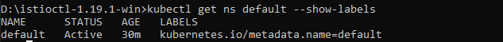
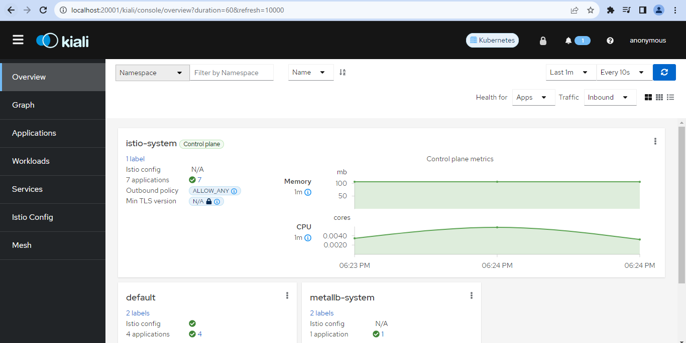
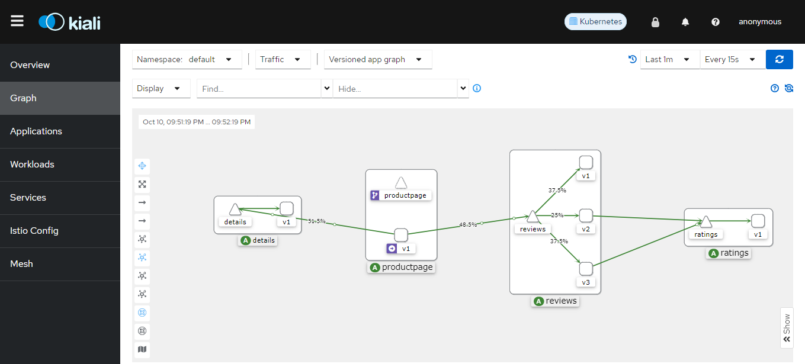
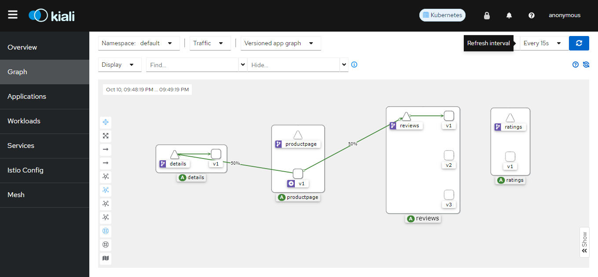
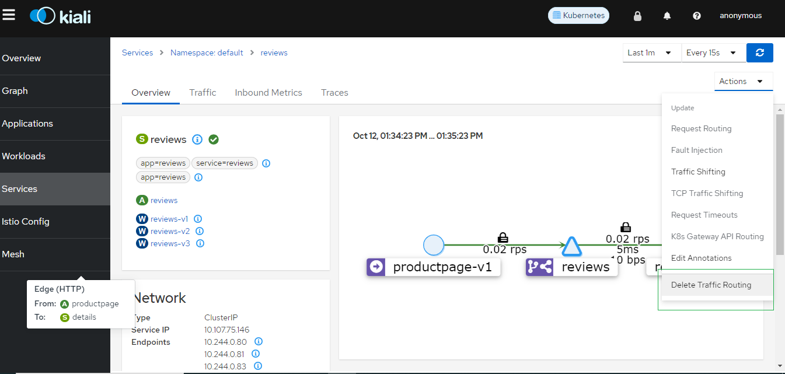

# Istio


# Table of contents 

- [Service Mesh](#service-mesh)
- [Istio](#istio-introduction)
- [Istio Architecture](#istio-architecture)
- [Envoy Proxy](#envoy-proxy)
- [Install Istio on microk8s](#istio-on-microk8s)

  - [Set Alias to microk8s kubectl command](#set-alias-to-microk8s-kubectl-command)
  - [Setting up MetalLB LoadBalancer](#setting-up-metallb-loadbalancer)
- [Deploy a sample microservice application](#deploy-a-sample-microservice-application)

  - [Set up Ingress Gateway](#set-up-ingress-gateway) 
  - [Access the Application Using External LoadBalancer](#access-the-application-using-external-loadbalancer)
  - [Access the Application using NodePort](#access-the-application-using-nodeport)
- [Monitoring and Data Visualisation](#monitoring-and-data-visualisation)
- [Istio Traffic Management](#istio-traffic-management)

  - [Sidecars](#sidecars)
  - [Virtual services](#virtual-services)
  - [Destination rules](#destination-rules)
  - [Gateways](#gateways)
  - [Service Entries](#service-entries)
  - [Istio Traffic Management Demo](#traffic-management-demo)
- [Istio Security](#istio-security)

  - [Istio Security Demo](#istio-security-demo)
- [References](#references)

# Service Mesh 


A service mesh is a dedicated infrastructure layer that controls `service-to-service communication` over a network. This method enables separate parts of an application to communicate with each other. Service meshes appear commonly in concert with cloud-based applications, containers and microservices. <br>
It allows you to transparently add capabilities like `observability`, `traffic management`, and `security`, without adding them to your own code.<br>
Service-to-service communication is what makes a distributed application possible. Routing this communication, both within and across application clusters, becomes increasingly complex as the number of services grow. Istio helps reduce this complexity while easing the strain on development teams.


**Why adopt a service mesh?**

An application structured in a microservices architecture might comprise dozens or hundreds of services, all with their own instances that operate in a live environment. It's a big challenge for developers to keep track of which components must interact, monitor their health and performance and make changes to a service or component if something goes wrong.

A service mesh enables developers to separate and manage service-to-service communications in a dedicated infrastructure layer. As the number of microservices involved with an application increases, so do the benefits of using a service mesh to manage and monitor them.


# Istio Introduction


Istio is started in `May 2017` which means `sail` in Greek and Developed in `Go` Language. <br>
Istio is an open-source service mesh platform that helps you manage and secure microservices in Kubernetes and other container orchestration platforms. <br>
Its powerful control plane brings vital features, including:<br>
<br>
- Secure service-to-service communication in a cluster with TLS encryption, strong identity-based authentication and authorization<br>
- Automatic load balancing for HTTP, gRPC, WebSocket, and TCP traffic<br>
- Fine-grained control of traffic behavior with rich routing rules, retries, failovers, and fault injection<br>
- A pluggable policy layer and configuration API supporting access controls, rate limits and quotas<br>
- Automatic metrics, logs, and traces for all traffic within a cluster, including cluster ingress and egress<br>

Istio is designed for extensibility and can handle a diverse range of deployment needs. Istio’s control plane runs on Kubernetes, and you can add applications deployed in that cluster to your mesh, extend the mesh to other clusters, or even connect VMs or other endpoints running outside of Kubernetes.


--------------------

Imagine you're developing a complex e-commerce application consisting of various microservices:

- Product Service: Provides information about products and their details.
- Shopping Cart Service: Manages user shopping carts.
- Order Service: Handles order processing and fulfillment.
- User Service: Manages user accounts and authentication

Each microservice is independently developed, deployed, and scaled. However, managing communication, security, and observability between these microservices can become challenging as the application scales. This is where Istio comes into play:


1. **Traffic Management:**


You want to control the flow of traffic between microservices, routing specific requests to different versions or instances of a service. For example, you want to gradually roll out a new version of the "Order Service" to a subset of users for testing purposes.<br>
Istio allows you to define `traffic routing rules`, enabling gradual deployments, A/B testing, canary releases, and blue-green deployments.

2. **Security:**


You need to secure communication between microservices to prevent unauthorized access. Ensuring data privacy and protecting against network-level threats is crucial.<br>
Istio provides `mTLS (mutual TLS) authentication` between services. It encrypts and authenticates traffic between services, ensuring secure communication. Istio also offers fine-grained access control, allowing you to define who can access each service.

3. **Observability:**

 
To monitor and troubleshoot your microservices, you need insights into their behavior, performance, and errors. You also want to trace requests through the application.<br>
Istio enhances observability through metrics, tracing, and logging. You can integrate Istio with tools like `Grafana`, `Kiali`, and `Prometheus` to monitor and troubleshoot your application. Install these tools and view the metrics and traces:<br>
`Grafana`: Visualization and monitoring. <br>
`Kiali`: Service mesh observability. <br>
`Prometheus`: Metrics collection. <br>

4. **Resilience:**

Microservices can fail for various reasons, and you need strategies to handle failures gracefully, such as retries and circuit breakers.

Istio provides features like `timeouts`, `retries`, and `circuit breakers` to enhance the resilience of your microservices. It automatically retries failed requests and limits the impact of service failures.

5. **Policy Enforcement:**

You want to enforce policies for traffic management, security, and access control consistently across all your microservices.

Istio allows you to define and `enforce policies` at the mesh level. You can implement consistent policies for `rate limiting`, `access control`, and `request routing`.

Istio simplifies the management of complex interactions between microservices. It ensures that communication is secure, reliable, observable, and controllable, even as the number of microservices and the complexity of your application grow. Istio provides these features while allowing developers to focus on building and deploying microservices without worrying about the intricacies of service-to-service communication.

# Istio Architecture 


Istio has two components: the `data plane` and the `control plane`.

The `data plane` is the communication between services. Without a service mesh, the network doesn’t understand the traffic being sent over, and can’t make any decisions based on what type of traffic it is, or who it is from or to.

Service mesh uses a proxy to intercept all your network traffic, allowing a broad set of application-aware features based on configuration you set.

An `Envoy proxy` is deployed along with each service that you start in your cluster, or runs alongside services running on VMs.

The `control plane` takes your desired configuration, and its view of the services, and dynamically programs the proxy servers, updating them as the rules or the environment changes.


# Envoy Proxy 

Envoy is an open-source edge and service proxy designed for cloud-native applications. It's a high-performance proxy that mediates all traffic between microservices, handles tasks like service discovery, load balancing, security (TLS termination), protocol support (HTTP/2, gRPC), fault tolerance mechanisms (circuit breakers), health checks, and advanced deployment strategies

Envoy proxies are deployed as sidecars to services.

Features Provided by Envoy as Sidecars

- Dynamic service dscovery
- Load balancing
- TLS termination
- HTTP/2 and gRPC proxies
- Circuit breakers
- Health checks
- Staged rollouts with %-based traffic split
- Fault injection
- Rich metrics

# Istio on microk8s

**Set up Microk8s on ubuntu**

MicroK8s is a lightweight Kubernetes distribution that's simple to install and set up. This guide will walk you
through the steps to install MicroK8s, add your user to the required group, check its status, and interact with
Kubernetes.

**Prerequisites**

**1. Operating System:**
MicroK8s is primarily designed for Linux distributions. It's available as a snap package which can be
installed on any system that supports snaps. Ubuntu 18.04 LTS and later versions are ideal.
MicroK8s is also available on macOS and Windows, but it runs in a VM in these environments.

**2. Snap Support:**
The system must have snapd installed, as MicroK8s is distributed as a snap package.

**3. Resources:**
CPU: 1 CPU core is the strict minimum, but 2 or more cores are recommended for smoother operations.
Memory: At least 2 GB of RAM, but 4 GB or more is recommended if you plan to enable additional
services or run applications.
Storage: A minimum of 20 GB of disk space is suggested.

**Step 1:** Install MicroK8s

Execute the following commands to install MicroK8s:

```bash +@Output
$ sudo snap install microk8s --classic --channel=latest/stable
```

**Step 2:** Configuring User Access

For a smoother experience with MicroK8s and to avoid consistently using sudo, you should add your user to
the microk8s group. This step ensures you can execute MicroK8s commands without elevated privileges.

Add your user to the 'microk8s' group to allow access to the cluster

```bash +@output
$ sudo usermod -a -G microk8s $USER
$ sudo chown -f -R $USER ~/.kube
$ newgrp microk8s
$ su - $USER

```

**Step 3:** Checking MicroK8s Status
MicroK8s comes with a useful status command to check its health and the services running.
To wait for MicroK8s to initialize and then check its status, use:

```bash +@Output
$ microk8s status --wait-ready
```

**Step 4:** Enable necessary MicroK8s add-ons 

```bash +@output
$ microk8s enable dns storage 
$ microk8s enable ingress dashboard
```

**Step 5:** Set up MetalLB Load Balancer

Load Balancer service is requied to expose the application out of the host machine. Finish this step and then continue with next step

[Set up metalLB](#setting-up-metallb-loadbalancer)

**Step 6:** Install Istio 
    
You can use the Istio add-on for MicroK8s to install Istio

```bash +@Output
$ microk8s enable community
$ microk8s enable istio
$ microk8s istioctl version
```

**Step 7:** Verify the new namespace `istio-system` has been added

```bash +@Output
$ microk8s kubectl get ns
# Observe the istio-system namespace created
$ microk8s kubectl get pods -n istio-system
# Observe the ingress-gateay with LoadBalancer service
$ microk8s kubectl get svc -n istio-system
```

## Set Alias to microk8s kubectl command

Create shortcut for the command `microk8s kubectl` by adding `alias`

```bash +@Output
$ nano ~/.bashrc
# Go to end of the file and add alias k8s ='microk8s kubectl'
# Exit from the editor using :wq
$ source ~/.bashrc
$  k8s get ns
# You should be able to see the list of namespaces available. From now on, we use the command 'k8s' instead of 'microk8s kubectl'
```

## Setting up MetalLB LoadBalancer 

MetalLB is a popular open-source solution for enabling LoadBalancer services on bare-metal Kubernetes clusters and local development environments. It provides a software-based load balancer implementation. You can install MetalLB on your local Kubernetes cluster to enable LoadBalancer services.

**Step 1:** Install MetalLB

```bash +@Output 
$ microk8s kubectl apply -f https://raw.githubusercontent.com/metallb/metallb/v0.10.2/manifests/namespace.yaml

$ microk8s kubectl apply -f https://raw.githubusercontent.com/metallb/metallb/v0.10.2/manifests/metallb.yaml

```

**Step 2:** Configure MetalLB
Apply the MetalLB configuration to enable it in Layer 2 mode.

Create a file metallb-config.yaml

```bash +@Output
$ nano metallb-config.yaml
# Paste the below yaml content 
```

```yaml
apiVersion: v1
kind: ConfigMap
metadata:
  namespace: metallb-system
  name: config
data:
  config: |
    address-pools:
    - name: default
      protocol: layer2
      addresses:
      - 172.18.255.200-172.18.255.250 # Specify the IP range here
```

**Step 3:** Create LoadBalancer Service

Define a service of type LoadBalancer for your application

```bash +@Output
$ microk8s kubectl apply -f metallb-config.yaml
```

# Deploy a sample microservice application 

Let us deploy a sample `BookInfo` application

The Bookinfo application is broken into four separate microservices:

**productpage:** The productpage microservice calls the details and reviews microservices to populate the page.

**details:** The details microservice contains book information.

**reviews:** The reviews microservice contains book reviews. It also calls the ratings microservice.

**ratings:** The ratings microservice contains book ranking information that accompanies a book review.

There are 3 versions of the reviews microservice:

- **Version v1** doesn’t call the ratings service.
- **Version v2** calls the ratings service, and displays each rating as 1 to 5 black stars.
- **Version v3** calls the ratings service, and displays each rating as 1 to 5 red stars.

The end-to-end architecture of the application is shown below.


<hr>

**Deploying the application:**

To run the sample with Istio requires no changes to the application itself. Instead, you simply need to configure and run the services in an Istio-enabled environment, with Envoy sidecars injected along side each service. The resulting deployment will look like this:


**Step 0.0:** Pull the copy of istio repository from Github

```bash +@Output
$ git clone https://github.com/istio/istio.git

```

**Step 0.1:**  Label namespace default istio-injection=enabled**

default label instruct istio to automatically inject Envoy Sidecar proxies when we deploy application

```bash +@Output
$ k8s get ns default --show-labels 
```



Label the default namespace 

```bash +@Output
$ k8s label namespace default istio-injection=enabled
$ k8s get ns default --show-labels 
```


**Step 1: Deploy your application using the kubectl command**

```bash +@Output
# Change the directory 
$ cd istio
$ k8s apply -f <(microk8s istioctl kube-inject -f ./samples/bookinfo/platform/kube/bookinfo.yaml)
```

**Step 2:The application will start. As each pod becomes ready, the Istio sidecar will be deployed along with it**

```bash +@Output
$ k8s get all
# Observation: Each pod has 2 container running, ie, istio injected a sidecar to each pod as a proxy container automatically
$ k8s describe pod <pod-name>
$ k8s describe pod/productpage-v1-6fcdb87d75-5xbpn 
# Observation: Check the container section 
```


**Step 3: To confirm that the Bookinfo application is running, send a request to it by a curl command from some pod, for example from ratings**

```bash +@Output
$ k8s exec "$(k8s get pod -l app=ratings -o jsonpath='{.items[0].metadata.name}')" -c ratings -- curl -sS productpage:9080/productpage | grep -o "<title>.*</title>"
 
```
The Output, 


## Set up Ingress Gateway

Istio also allows you to configure ingress traffic using either an Istio Gateway or Kubernetes Gateway resource. A `Gateway` provides more extensive customization and flexibility than Ingress, and allows Istio features such as monitoring and route rules to be applied to traffic entering the cluster.


**Step 1: Determine the ingress IP and port**

Now that the Bookinfo services are up and running, you need to make the application accessible from outside of your Kubernetes cluster, e.g., from a browser. A gateway is used for this purpose.

Create an Istio Gateway using the following command:

```bash +@Output
$ k8s apply -f ./samples/bookinfo/networking/bookinfo-gateway.yaml
 
```

**Step 2:** Confirm the gateway has been created:

```bash +@Output
$ k8s get gateway
 
```

**Step 3:** Set GATEWAY_URL:

Set the following environment variables to the name and namespace where the Istio ingress gateway is located in your cluster:

```bash +@Output
$ export INGRESS_NAME=istio-ingressgateway
$ export INGRESS_NS=istio-system
```

**Step 4:** Determine if your cluster is in an environment that supports external load balancers

```bash +@Output
$ k8s get svc "$INGRESS_NAME" -n "$INGRESS_NS"

```

If the EXTERNAL-IP value is set, your environment has an external load balancer that you can use for the ingress gateway. If the EXTERNAL-IP value is <none> (or perpetually <pending>), your environment does not provide an external load balancer, you can try accessing the ingress gateway using node ports.


## Access the Application Using External LoadBalancer 

If the EXTERNAL-IP value is set, your environment has an external load balancer that you can use for the ingress gateway. 


```bash +@Output
$ export INGRESS_HOST=$(k8s -n "$INGRESS_NS" get service "$INGRESS_NAME" -o jsonpath='{.status.loadBalancer.ingress[0].ip}')
$ export INGRESS_PORT=$(k8s -n "$INGRESS_NS" get service "$INGRESS_NAME" -o jsonpath='{.spec.ports[?(@.name=="http2")].port}')
$ export SECURE_INGRESS_PORT=$(k8s -n "$INGRESS_NS" get service "$INGRESS_NAME" -o jsonpath='{.spec.ports[?(@.name=="https")].port}')
$ export TCP_INGRESS_PORT=$(k8s -n "$INGRESS_NS" get service "$INGRESS_NAME" -o jsonpath='{.spec.ports[?(@.name=="tcp")].port}')
```

Set GATEWAY_URL:

```bash +@Output
$ export GATEWAY_URL=$INGRESS_HOST:$INGRESS_PORT
```

Confirm the app is accessible from outside the cluster:

To confirm that the Bookinfo application is accessible from outside the cluster, run the following curl command:

```bash +@Output
$ curl -s "http://${GATEWAY_URL}/productpage" | grep -o "<title>.*</title>"
```

**Step 4: Access the application**

```bash +@Output
$ k8s get svc -n istio-system
# In your output, the istio-ingressgateway service has a  EXTERNAL-IP column. 
 
```

> The `Istio ingress gateway` is responsible for routing external traffic into the service mesh. It exposes services to the external world and typically uses a LoadBalancer service type to provide an external IP address.

Let us access the application `productpage` using curl command 

```bash +@Output
$ curl http://External-IP/productpage 
```

Let us access the application `productpage` in the browser

```bash +@Output
# Allow Host access 
$ microk8s enable host-access
# Access the application with the url, http://Host-IP:portNumber/productpage
```

## Access the Application using NodePort

If your environment does not support external load balancers, i.e, If your `istio-ingressgateway` `External-IP` is `none` or `pending`, then you can access application by using the istio-ingressgateway service’s node ports.

**Step 1:** Set the ingress Ports 

```bash +@Output
$ export INGRESS_PORT=$(k8s -n "${INGRESS_NS}" get service "${INGRESS_NAME}" -o jsonpath='{.spec.ports[?(@.name=="http2")].nodePort}')

$ export SECURE_INGRESS_PORT=$(k8s -n "${INGRESS_NS}" get service "${INGRESS_NAME}" -o jsonpath='{.spec.ports[?(@.name=="https")].nodePort}')

$ export TCP_INGRESS_PORT=$(k8s -n "${INGRESS_NS}" get service "${INGRESS_NAME}" -o jsonpath='{.spec.ports[?(@.name=="tcp")].nodePort}')
```

**Step 2:** Setting the ingress IP depends on the cluster provider 

```bash +@Output
$ export INGRESS_HOST=$(k8s get po -l istio=ingressgateway -n "${INGRESS_NS}" -o jsonpath='{.items[0].status.hostIP}')

```

**Step 3:** Inspect the values of the INGRESS_HOST and INGRESS_PORT environment variables. 

```bash +@Output
$ echo "INGRESS_HOST=$INGRESS_HOST, INGRESS_PORT=$INGRESS_PORT"

```


**Step 4:** Access the application using the IP and the Port outside the cluster

**Curl on your ubuntu terminal**

```bash +@Output
$ curl <INGRESS_HOST>:<INGRESS_PORT>/productpage
$ curl 139.59.57.185:31049/productpage
```

**Access from your host browser**

Access the url , http://<INGRESS_HOST>:<INGRESS_PORT>/productpage


# Monitoring and Data Visualisation 

To add monitoring and visualization tools on istio, if you check the istio downloaded folder, we have samples/addons ( In my case, ~/istio/samples/addons) You can see the addons like prometheus, grafana, jaeger, kiali etc.. 

To add the required addons, just run, 

```bash +@Output
$ k8s apply -f samples/addons/addon-name.yaml
# Here im adding all of it 
$ k8s apply -f samples/addons
# Verify the services 
$ k8s get all -n istio-system
```

**Prometheus**
**Grafana:**

**Kiali:**

Kiali is an open-source observability and management console for Istio, a popular service mesh platform used in Kubernetes environments. Kiali is designed to simplify the management and monitoring of microservices-based applications that use Istio for traffic management, security, and observability.


**Key features and use cases of Kiali include:**

- Service Graph Visualization
- Traffic Flow Analysis
- Service Health and Metrics
- Dependency Mapping
- Security Policy Visualization
- Traffic Routing and Configuration
- Istio Configuration Validation
- Tracing Integration
- User-Friendly UI

We will look into these features in the kiali dashboard 

```bash +@Output
$ k8s get svc -n istio-system
```


Notice that, kiali svc is a `clusterIP` service. Inorder to access kiali dashboard, edit kiali service and change to `NodePort`

```bash +@Output
$ k8s edit svc kiali -n istio-system
# Access Kiali dashboard with <hostIP>:<svc-port>
# http://206.189.138.81:31677
```



> [Visualise the data on the kiali dashboard](https://istio.io/latest/docs/tasks/observability/kiali/)


> NOTE: In further concepts, we use kiali dashboard to visualise

# Istio Traffic Management


Istio’s traffic routing rules let you easily control the flow of traffic and API calls between services.

Istio’s traffic management model relies on the Envoy proxies that are deployed along with your services. All traffic that your mesh services send and receive (data plane traffic) is proxied through Envoy, making it easy to direct and control traffic around your mesh without making any changes to your services.

In order to direct traffic within your mesh, Istio needs to know where all your endpoints are, and which services they belong to. To populate its own service registry, Istio connects to a service discovery system. For example, if you’ve installed Istio on a Kubernetes cluster, then Istio automatically detects the services and endpoints in that cluster.

You can also configure istio traffic configuration to direct a particular percentage of traffic to a new version of a service as part of A/B testing, or apply a different load balancing policy to traffic for a particular subset of service instances.

Like other Istio configuration, the API is specified using Kubernetes custom resource definitions (CRDs), which you can configure using YAML

Some of the traffic management API resources,

1. Virtual Services 
2. Destination rules
3. Gateways 
4. Service entries 
5. Sidecars

## Sidecars 

 The sidecar container is typically an instance of the Envoy proxy, which is responsible for handling communication between services within the service mesh. <br>
By default, Istio configures every Envoy proxy to accept traffic on all the ports of its associated workload, and to reach every workload in the mesh when forwarding traffic. <br><br>You can use a sidecar configuration to do the following:
<br>
- Fine-tune the set of ports and protocols that an Envoy proxy accepts.<br>
- Limit the set of services that the Envoy proxy can reach.

**Key Features of Sidecars**

**Proxy Functionality:**

The sidecar in Istio is an instance of the Envoy proxy, which provides features such as load balancing, traffic management, and security.

Example: The sidecar handles incoming and outgoing traffic for the application container, implementing various Istio features.

**Service Mesh Integration:**

Sidecars are an integral part of the Istio service mesh architecture, enabling features like service discovery, monitoring, and security policies.

Example: The sidecar facilitates communication between microservices within the mesh and participates in the implementation of Istio's control plane functionalities.

**Dynamic Configuration:**

Sidecars can be dynamically configured to adapt to changes in the service mesh, allowing for on-the-fly updates to routing, load balancing, and other settings.

Example: Istio's Pilot component continuously pushes configuration updates to sidecars based on changes in the service mesh.

**Observability:**

Sidecars collect and emit telemetry data, providing insights into the behavior and performance of services within the mesh.

Example: Metrics, traces, and logs generated by the sidecar contribute to Istio's observability features.

**Security:**

Sidecars enforce security policies such as mutual TLS (mTLS) between services, ensuring secure communication within the service mesh.

Example: The sidecar manages encryption and decryption of traffic, implementing Istio's security features.


## Virtual Services

A virtual service lets you configure how requests are routed to a service within an Istio service mesh, building on the basic connectivity and discovery provided by Istio and your platform. Each virtual service consists of a set of routing rules that are evaluated in order, letting Istio match each given request to the virtual service to a specific real destination within the mesh. 

Virtual services play a key role in making Istio’s traffic management flexible and powerful. They do this by strongly decoupling where clients send their requests from the destination workloads that actually implement them.

Without virtual services, Envoy distributes traffic using least requests load balancing between all service instances.

For example, 

A typical use case is to send traffic to different versions of a service, specified as service subsets. Clients send requests to the virtual service host as if it was a single entity, and Envoy then routes the traffic to the different versions depending on the virtual service rules: for example, “20% of calls go to the new version” or “calls from these users go to version 2”. This allows you to, for instance, create a canary rollouts.

**Key Features of Virtual Services**

**Traffic Routing:**

Virtual services define the rules for routing traffic to different destination services.

Example: You can route a percentage of traffic to a new version of a service for canary testing or blue-green deployments.

**Request Matching:**

Virtual services allow you to specify criteria for matching incoming requests.

Example: You can match requests based on HTTP headers, paths, or other attributes.

**Timeouts and Retries:**

Virtual services let you configure timeouts for requests and specify the number of retries in case of failures.

Example: You can set a timeout for a request and specify that it should be retried if the initial attempt fails.

**Fault Injection:**

Virtual services support fault injection for testing the resilience of your services.

Example: You can inject delays or errors into requests to simulate different failure scenarios.

**Load Balancing:**

Virtual services allow you to configure load balancing policies for distributing traffic among different service instances.

Example: You can use round-robin or weighted load balancing strategies.

**TLS Configuration:**

Virtual services enable you to configure TLS settings for secure communication between services.

Example: You can specify whether to use mutual TLS and configure the required certificates.

**Retirement and Mirroring:**

Virtual services support retiring old versions of services and mirroring traffic for testing purposes.

Example: You can gradually shift traffic away from an old version of a service and mirror requests to a new version for monitoring.

**Virtual services also let you:**

- Address multiple application services through a single virtual service. 
- Configure traffic rules in combination with gateways to control ingress and egress traffic.

## Destination rules

Destination rules are applied after virtual service routing rules are evaluated, so they apply to the traffic’s “real” destination.

You can think of virtual services as how you route your traffic to a given destination, and then you use destination rules to configure what happens to traffic for that destination.

**Key Features of Destination Rules**

**Subset Definition:**

Destination Rules allow you to define subsets of a service based on labels.

Example: You can define subsets like "v1" and "v2" based on the version labels of your services.

**Traffic Policies:**

Destination Rules enable you to configure traffic policies for each subset, including load balancing and connection pool settings.

Example: You can specify that 80% of traffic should go to "v1" and 20% to "v2" for canary deployments.

**Connection Pool Settings:**

Destination Rules allow you to set connection pool settings such as maximum connections, maximum pending requests, etc.

Example: You can limit the number of concurrent connections to each version of a service.

**Circuit Breaking:**

Destination Rules support circuit breaking to prevent failures from overwhelming a service.

Example: You can set thresholds for the number of consecutive connection or request failures before a circuit is opened.

**TLS Settings:**

Destination Rules enable you to configure TLS settings for secure communication between services.

Example: You can specify whether to use mutual TLS for communication between specific subsets.

**Load balancing options**

By default, Istio uses a least requests load balancing policy, where requests are distributed among the instances with the least number of requests. Istio also supports the following models,

Random: Requests are forwarded at random to instances in the pool.
Weighted: Requests are forwarded to instances in the pool according to a specific percentage.
Round robin: Requests are forwarded to each instance in sequence.


## Gateways

You use a gateway to manage inbound and outbound traffic for your mesh, letting you specify which traffic you want to enter or leave the mesh. Gateway configurations are applied to standalone Envoy proxies that are running at the edge of the mesh, rather than sidecar Envoy proxies running alongside your service workloads.

Istio gateways let you use the full power and flexibility of Istio’s traffic routing. You can do this because Istio’s Gateway resource just lets you configure layer 4-6 load balancing properties such as ports to expose, TLS settings, and so on.

Gateways are primarily used to manage ingress traffic, but you can also configure egress gateways.

**Key Features of Gateways**

**External Service Exposure:**

Gateways provide a way to expose services in the service mesh to external networks.

Example: You can use a Gateway to expose an application to the internet or to other networks outside the mesh.

**Host-Based Routing:**

Gateways support host-based routing, allowing you to route traffic based on the hostname in the HTTP request.

Example: You can route traffic to different services based on the domain name used in the request.

**TLS Termination:**

Gateways can terminate TLS (HTTPS) connections on behalf of services, providing secure communication.

Example: You can configure a Gateway to handle SSL/TLS encryption and decryption for incoming requests.

**Load Balancing:**

Gateways can distribute incoming requests to different instances of a service, providing load balancing functionality.

Example: You can use round-robin or weighted load balancing strategies to distribute traffic.

**HTTP and TCP Traffic Handling:**

Gateways support both HTTP and TCP traffic, allowing you to handle various types of protocols.

Example: You can configure a Gateway to handle HTTP traffic for web applications or TCP traffic for other services.


## Service Entries

You use a service entry to add an entry to the service registry that Istio maintains internally. After you add the service entry, the Envoy proxies can send traffic to the service as if it was a service in your mesh. Configuring service entries allows you to manage traffic for services running outside of the mesh, including the following tasks:

- Redirect and forward traffic for external destinations, such as APIs consumed from the web, or traffic to services in legacy infrastructure.
- Define retry, timeout, and fault injection policies for external destinations.
- Run a mesh service in a Virtual Machine (VM) by adding VMs to your mesh.

**Key Features of Service Entries**

**Defining External Services:**

Service Entries allow you to define external services and their associated endpoints.

Example: You can define a Service Entry for an external API or database.

**Custom Hostnames and Ports:**

Service Entries support custom hostnames and ports, providing flexibility in specifying how services are accessed.

Example: You can define a custom hostname and port for an external service.

**TLS Configuration:**

Service Entries enable you to configure TLS settings for secure communication with external services.

Example: You can specify whether to use mutual TLS for communication with an external service.

**Load Balancing:**

Service Entries allow you to configure load balancing settings for external services.

Example: You can specify load balancing policies when accessing an external service.

**Health Checking:**

Service Entries support health checking to determine the health status of external services.

Example: You can configure Istio to perform health checks before directing traffic to an external service.

## Traffic Management Demo

First let us create some traffic by hitting the product service url repeatedly.
To achieve this, im going to run a script in the chrome browser that refreshes the page every 3 seconds

- Open the browser with the url where product service is running. ie, http://<host-ip>:port
- Open developer tools 
- In the console, Run the below script and press enter 

```js 
const refreshWindow = window.open(document.URL);
const intervalId = setInterval(() => {
    try {
        refreshWindow.location.reload();
    } catch (error) {
        if (error instanceof TypeError) { // TypeError means that .reload is not available, i.e. user has closed the refreshWindow
            clearInterval(intervalId); // Run clearInterval to close out this process
        }
    }
}, 300); 

```

This will refresh the page every 3 seconds creating some traffic for us to visualise our data.

In our example if you observe GRAPH in KIALI Dashboard , observe the traffic has been distributed to all 3 versions of review service.




**How to apply Traffic Rules**


**Step 1:** Create a `VirtualService` and define the routing rule where you want to route traffic with. Sample code is shown below:

``` yaml 
apiVersion: networking.istio.io/v1alpha3
kind: VirtualService
metadata:
  name: productpage
spec:
  hosts:
  - productpage
  http:
  - route:
    - destination:
        host: productpage
        subset: v1
```
Let's break down the key components of this configuration:

**apiVersion:** Specifies the Istio API version that this configuration adheres to. In this case, it's networking.istio.io/v1alpha3, indicating that it's using the Istio networking API version 1alpha3.

**kind:** Specifies the type of resource being defined. Here, it's a VirtualService. A VirtualService in Istio allows you to configure how traffic is routed to different versions of your services.

**metadata:** Contains metadata about the VirtualService, including its name. In this case, the name is set to "productpage."

**spec:** Defines the specifications for the VirtualService.

**hosts:** Specifies the hosts to which this VirtualService applies. In this case, it's set to "productpage," meaning that this VirtualService is intended for the service with the hostname "productpage."

**http:** Describes the HTTP routing rules for the specified hosts.

**route:** Defines a set of routing rules.

**destination**: Specifies the destination for the traffic.

**host:** The host to which the traffic is routed. In this case, it's "productpage."

**subset:** This is a way to perform traffic splitting based on subsets of a service. It suggests that the traffic should be directed to the subset named "v1" of the service "productpage."

In summary, this Istio VirtualService configuration is instructing the service mesh to route HTTP traffic for the host "productpage" to the subset "v1" of the service with the same host name. This is useful for scenarios where you have multiple versions of a service, and you want to control how traffic is distributed among those versions.

### Scenario 1: Traffic shifting

Let us apply traffic shifting for `Bookinfo services` and make 100% of the traffic to version1 of reviews service. 

we already have a yaml file present in the folder (From the istio folder, samples\bookinfo\networking\virtual-service-all-v1.yaml)

```bash +@Output
$ k8s apply -f samples\bookinfo\networking\bookinfo-gateway.yaml
$ k8s apply -f samples\bookinfo\networking\virtual-service-all-v1.yaml
$ k8s apply -f samples\bookinfo\networking\destination-rule-all.yaml
```

**Observe the kiali dashboard, slowly all the traffic will be directed and sent to v1 of review service**



```bash +@Output
$ k8s delete -f samples\bookinfo\networking\virtual-service-all-v1.yaml
```

You can also do this from the kiali dashboard.

i. Under the Graph section, click on reviews (triangle-review) and in the right side click on service -review 


ii. In the Actions -> `Delete Traffic Routing` 



iii. `Create Traffic shifting `

Actions -> Traffic Shifting -> Adjust the weights of traffic -> Review and update 

In order case, since we are trying to move all the traffic to v1, i will set the weight to 100% 


**Observe the kiali dashboard, slowly al the traffic will be directed and sent to v1 of review service**


### Scenario 2: Traffic Redirecting

Let us redirect the traffic to v2 and v3. Check the yaml file virtual-service-reviews-v2-v3.yaml

```bash +@Output
# Delete the previous configuration 
$ k8s delete -f samples\bookinfo\networking\virtual-service-all-v1.yaml
# Apply new configuration 
$ k8s apply -f samples\bookinfo\networking\virtual-service-reviews-v2-v3.yaml
```
**Observe the kiali dashboard**

### Scenario 3: Matching Routing 

Matching routing is redirecting the traffic to a specific version if something matches for example, request header. 

In our example, let us match the end-user in the request header. If the request is coming from the user for example: `jason`, direct the traffic to specific version of reviews ie, `v2`

> NOTE: Delete if any rules applied before

```bash +@Output
$ k8s get vs
$ k8s apply -f samples\bookinfo\networking\virtual-service-reviews-jason-v2-v3.yaml
```

From the http://<host-ip>:<port-number>/productpage, click on sigin and login with user `jason` and password can be anything, and observe you are getting `v2` review page. Refresh several times and observe the output
Similarly, try loggin in with different user and observe the difference 

# Istio Security

Istio provides several security features, including mutual TLS (mTLS) authentication, access control, and rate limiting


The goals of Istio security are:

Security by default: no changes needed to application code and infrastructure
Defense in depth: integrate with existing security systems to provide multiple layers of defense
Zero-trust network: build security solutions on distrusted networks


## Istio Security Demo

**Prerequisites:** Ensure that the Bookinfo application is deployed, and you've enabled Istio sidecar, as mentioned in the previous steps.

### Mutaual TLS(mTLS) Authentication 

Mutual TLS authentication ensures that all communication between services is secure and authenticated. Istio can automatically enforce mTLS between services.

When a workload sends a request to another workload using mutual TLS authentication, the request is handled as follows:

1. Istio re-routes the outbound traffic from a client to the client’s local sidecar Envoy.
2. The client side Envoy starts a mutual TLS handshake with the server side Envoy. During the handshake, the client side Envoy also does a secure naming check to verify that the service account presented in the server certificate is authorized to run the target service.
3. The `client side Envoy` and the `server side Envoy` establish a `mutual TLS connection`, and Istio forwards the traffic from the client side Envoy to the server side Envoy.
4. The server side Envoy authorizes the request. If authorized, it forwards the traffic to the backend service through local TCP connections.

**How to enable mtls between services**

**Step 1:** Create a destination-rule and add under traffic policy, tls mode `ISTIO_MUTUAL`. Sample code is shown below:

```yaml
apiVersion: networking.istio.io/v1alpha3
kind: DestinationRule
metadata:
  name: productpage
spec:
  host: productpage
  trafficPolicy:
    tls:
      mode: ISTIO_MUTUAL
  subsets:
  - name: v1
    labels:
      version: v1
      
```

Let's break down the key components of this configuration:

**apiVersion:** Specifies the Istio API version that this configuration adheres to. In this case, it's networking.istio.io/v1alpha3, indicating the Istio networking API version 1alpha3.

**kind:** Specifies the type of resource being defined. Here, it's a DestinationRule.

**metadata:** Contains metadata about the DestinationRule, including its name. In this case, the name is set to "productpage."

**spec:** Defines the specifications for the DestinationRule.

**host:** Specifies the host (destination service) to which this rule applies. In this case, it's set to "productpage."

**trafficPolicy:** Describes the traffic-related policies for the destination.

**tls:** Describes the TLS (Transport Layer Security) settings for the traffic to this destination.

**mode:** Specifies the TLS mode. In this case, it's set to ISTIO_MUTUAL. This means that mutual TLS authentication is enabled for the traffic to the "productpage" service. Mutual TLS requires both the client and the server to present certificates for authentication.
subsets: Defines subsets for the destination service. Subsets are used to apply specific policies or direct traffic to specific versions or instances of a service.

**name:** Specifies the name of the subset. In this case, it's "v1."

**labels:** Specifies labels that identify the subset. The subset "v1" is associated with services that have the label "version: v1." This allows you to apply specific policies or routing rules to instances of the service that have this label.

In summary, this DestinationRule configuration is specifying that for the "productpage" service, mutual TLS authentication (ISTIO_MUTUAL mode) should be enforced, and there is a subset named "v1" with a label identifying services with the version "v1." This provides a way to apply specific policies to the traffic destined for the "productpage" service, especially when there are multiple versions or instances of that service.


Let us apply and enforce mtls for `Bookinfo services`

**i. Enforce mTLS**

**Step 1: Enable mTLS for the Bookinfo services by creating a DestinationRule that specifies mTLS**


```bash +@Output
$ k8s apply -f samples\bookinfo\networking\destination-rule-all-mtls.yaml

```

**Step 2: Verify that mTLS is enforced**

Verify that mTLS is enforced. In a secure communication, you should see "TLS" in the "TLS Mode" column in Kiali's service graph visualization

**Observation:**

Navigate to the "Service Graph" section in Kiali to visualize the connections between services.

Pay attention to the lines connecting the services. These lines represent the communication between services.

Hover over the lines to see additional details about the communication, including the mTLS status.

**ii. Deny Access to Specific Service**

**Step 1: Create an "Access Control" policy to deny access to one of the services (e.g., the "ratings" service)**

```yaml
apiVersion: security.istio.io/v1beta1
kind: AuthorizationPolicy
metadata:
  name: deny-ratings
spec:
  selector:
    matchLabels:
      app: ratings
  action: DENY
```

**Step 2: Verify that access to the "ratings" service is denied, and Kiali reflects the denied access**


### Access Control with Authorization Policies

Istio provides fine-grained access control using Authorization Policies. Let's create a policy to allow access to the "ratings" service only for users with the "jason" header.

**Step 1: Create an Authorization Policy to allow access to the "ratings" service only for requests with the "jason" header**

```yaml
apiVersion: security.istio.io/v1beta1
kind: AuthorizationPolicy
metadata:
  name: allow-jason
spec:
  selector:
    matchLabels:
      app: ratings
  rules:
  - from:
    - source:
        requestPrincipals: ["*"]
    to:
    - operation:
        methods: ["GET"]
  when:
  - key: request.headers[x-end-user]
    values: ["jason"]
```

**Step 2: Verify that the policy allows access to the "ratings" service only when the request contains the "jason" header.**

### Rate Limiting

Istio allows you to apply rate limiting policies to services. Let's create a rate limiting policy to restrict access to the "ratings" service.

**Step 1: Create a rate limiting policy for the "ratings" service**

```yaml
apiVersion: networking.istio.io/v1beta1
kind: EnvoyFilter
metadata:
  name: ratings-ratelimit
spec:
  workloadSelector:
    labels:
      app: ratings
  configPatches:
  - applyTo: HTTP_FILTER
    match:
      context: SIDECAR_INBOUND
      listener:
        filterChain:
          filter:
            name: "envoy.filters.network.http_connection_manager"
    patch:
      operation: INSERT_BEFORE
      value:
        name: envoy.filters.http.local_ratelimit
        typed_config:
          "@type": type.googleapis.com/envoy.extensions.filters.http.local_ratelimit.v3.LocalRateLimit
          stat_prefix: local_rate_limit
          token_bucket:
            max_tokens: 1000
            tokens_per_fill: 100
            fill_interval: 60s
            max_queue_size: 1
```

**Step 2: Verify that the rate limiting policy is applied to the "ratings" service, and you can observe the rate limits in action**

# References 

- https://istio.io/latest/docs/


